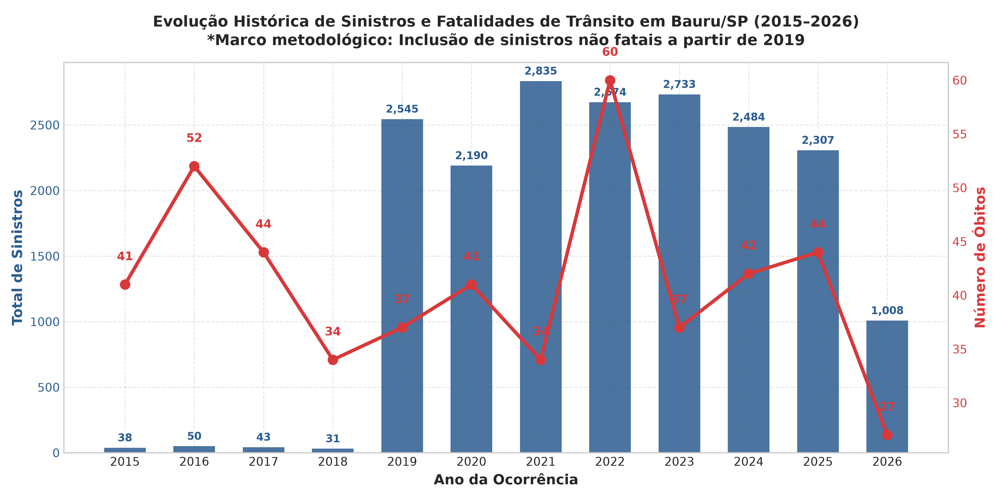
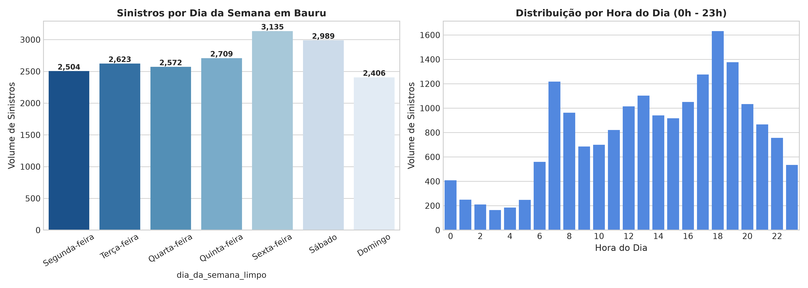
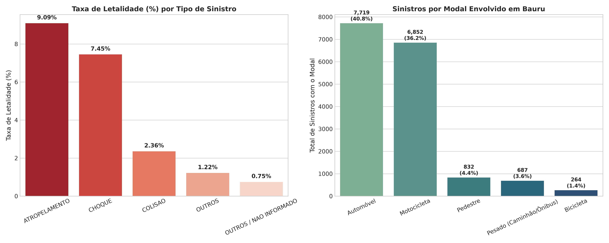
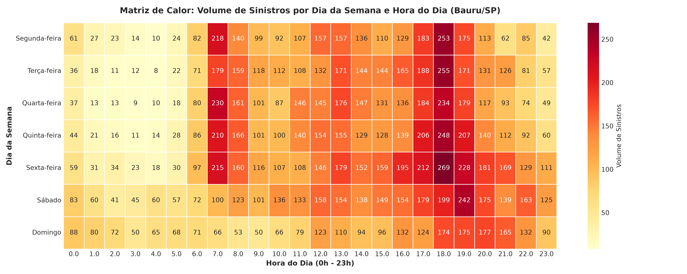
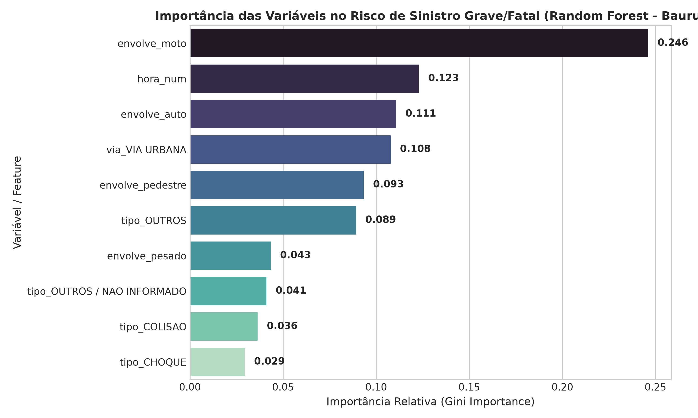

# 🚦 Análise e Diagnóstico de Acidentes de Trânsito em Bauru/SP (2015–2026)

[](https://www.python.org/)
[](https://pandas.pydata.org/)
[](https://scikit-learn.org/)
[](https://plotly.com/)
[]()

Estudo completo de Ciência de Dados sobre os sinistros de trânsito ocorridos no município de **Bauru/SP** ao longo de mais de 11 anos (março de 2015 a agosto de 2026). O projeto abrange desde a ingestão otimizada de dados estaduais volumosos até modelagem preditiva supervisionada de gravidade e visualização geoespacial interativa.

---

## 📌 Sumário Executivo

- **Fonte de Dados:** Infosiga SP (Movimento Paulista de Segurança no Trânsito / Governo do Estado de SP).
- **Volume Consolidado:** **18.938 sinistros** registrados em Bauru (`cod_ibge == 3506003`), com **17.422 acidentes georreferenciados válidos (92,0%)**.
- **Otimização de Memória:** Pipeline de ingestão em lotes (*chunks*) que processou mais de 450 MB de dados brutos estaduais, gerando um dataset limpo e enriquecido de **6,9 MB** (`data/bauru_limpo.csv`).
- **Descoberta Central de Risco:** **Atropelamentos** lideram a taxa de letalidade (**9,09%**), seguidos imediatamente por **Choques contra obstáculos fixos** (**7,45%**), letalidades entre 3 e 4 vezes superiores à de colisões veiculares comuns (2,36%).
- **Preditor #1 de Severidade:** A presença de **motocicletas** (presentes em **36,2%** de todos os acidentes) e o **horário noturno/madrugada** despontaram como as variáveis mais determinantes para acidentes com lesões graves ou morte.
- **Pico Temporal:** Os intervalos entre **11h–13h** (almoço) e **17h–19h** (saída do trabalho/comércio) concentram os maiores volumes de colisões na malha urbana.
- **Teste Estatístico:** Média diária idêntica entre dias úteis (**6,98 acidentes/dia**) e finais de semana (**7,07 acidentes/dia**), com $p\text{-valor} = 0,55$ no teste t de Student.

---

## 📂 Estrutura do Projeto

```text
projeto_transito_bauru/
│
├── data/
│   ├── sinistros_2015-2021.csv        # Dado bruto estadual (Infosiga)
│   ├── sinistros_2022-2024.csv        # Dado bruto estadual (Infosiga)
│   ├── sinistros_2025-2026.csv        # Dado bruto estadual (Infosiga)
│   ├── pessoas_*.csv                  # Registros brutos de pessoas envolvidas
│   ├── veiculos_*.csv                 # Registros brutos de veículos envolvidos
│   └── bauru_limpo.csv                # Dataset tratado consolidado de Bauru (2015-2026)
│
├── notebooks/
│   ├── 01-exploracao.ipynb            # Leitura diagnóstica, chunks e auditoria de nulos
│   ├── 02-limpeza.ipynb               # Unificação de períodos, tipos e feature engineering
│   ├── 03-analise-bauru.ipynb         # EDA temporal, modais, teste t e Machine Learning
│   └── 04-visualizacoes.ipynb         # Mapeamento geoespacial interativo (Plotly Carto)
│
├── output/
│   ├── graficos/                      # Figuras PNG de alta resolução e mapa HTML
│   │   ├── acidentes_por_ano.png
│   │   ├── acidentes_dia_e_hora.png
│   │   ├── tipos_e_veiculos.png
│   │   ├── heatmap_dia_hora.png
│   │   ├── importancia_features_ml.png
│   │   └── mapa_acidentes.html
│   └── relatorios/
│       ├── relatorio_final_bauru.md   # Relatório técnico-executivo completo
│       └── resumo_anual_bauru.csv     # Tabela anual agregada de vítimas
│
├── scripts/
│   ├── process_bauru_pipeline.py      # Script automatizado do pipeline ponta a ponta
│   └── create_notebooks.py            # Gerador dos notebooks Jupyter documentados
│
├── requirements.txt                   # Dependências do projeto
└── README.md                          # Este arquivo
```

---

## 📊 Principais Resultados e Visualizações

### 1. Evolução Histórica Anual (2015–2026)
A análise temporal revela o marco metodológico do Infosiga: até 2018 o sistema registrava exclusivamente fatalidades (30 a 50 mortes anuais); a partir de 2019, o registro foi ampliado para sinistros não fatais (atingindo a faixa de 2.200 a 2.800 ocorrências por ano em Bauru).



---

### 2. Padrões de Horário e Dias da Semana
Sexta-feira desponta como o dia com maior frequência de sinistros. A distribuição horária reflete com precisão os deslocamentos pendulares da cidade (picos às 12h e às 18h). Um teste de hipótese (*Student's t-test*) comprovou que a média diária de acidentes é estatisticamente estável entre dias úteis (**6,98 acidentes/dia**) e fins de semana (**7,07 acidentes/dia**), com $p\text{-valor} = 0,55$.



---

### 3. Modais e a Letalidade por Tipo de Sinistro
Automóveis (40,8%) e Motocicletas (36,2%) dominam as ocorrências. No entanto, os atropelamentos e choques contra postes e obstáculos fixos respondem pela maior taxa de mortes:



| Tipo de Sinistro | Total de Casos | Óbitos | Feridos Graves | Taxa de Letalidade (%) |
| :--- | :---: | :---: | :---: | :---: |
| **ATROPELAMENTO** | 1.364 | 124 | 129 | **9,09%** |
| **CHOQUE** | 1.235 | 92 | 136 | **7,45%** |
| **COLISÃO** | 7.505 | 177 | 671 | **2,36%** |
| **OUTROS** | 7.225 | 88 | 186 | **1,22%** |
| **NÃO INFORMADO** | 1.609 | 12 | 14 | **0,75%** |

---

### 4. Matriz de Calor: Dia da Semana vs Hora do Dia
Identificação visual das faixas mais críticas da rotina de trânsito de Bauru.



---

### 5. Modelo Preditivo (Random Forest)
Treinamento de um classificador supervisionado com balanceamento ponderado de classes (`class_weight='balanced'`), atingindo **ROC-AUC de 0,801**. O ranking de importância de variáveis comprovou empiricamente que a **presença de motocicleta**, o **horário do sinistro** e o **tipo de via (rodovias vs vias urbanas)** são as variáveis que mais governam a severidade do acidente.



---

### 6. Mapeamento Geoespacial Interativo
Construído com **Plotly** e renderizado sobre o estilo **Carto Positron**, mapeando 17.422 sinistros válidos. O mapa comprova que enquanto a área urbana central (Av. Nações Unidas, Av. Duque de Caxias, Av. Rodrigues Alves) concentra colisões com feridos leves, os eixos das rodovias **SP-300 (Marechal Rondon)**, **SP-225 (Bauru–Jaú)** e **SP-294 (Bauru–Marília)** concentram as fatalidades em alta velocidade.

> 🗺️ **Acesse o mapa interativo:** Abra o arquivo `output/graficos/mapa_acidentes.html` diretamente no seu navegador.

---

## 🛠️ Como Reproduzir este Projeto

### 1. Criar e ativar o ambiente virtual:
```bash
python3 -m venv .venv
source .venv/bin/activate  # No Windows: .venv\Scripts\activate
```

### 2. Instalar as dependências:
```bash
pip install -r requirements.txt
```

### 3. Execução Automatizada do Pipeline:
Para reprocessar todos os dados, gráficos, mapa e relatórios:
```bash
python scripts/process_bauru_pipeline.py
```

### 4. Execução dos Notebooks Interativos:
Execute os notebooks na ordem cronológica de desenvolvimento:
1. `notebooks/01-exploracao.ipynb`
2. `notebooks/02-limpeza.ipynb`
3. `notebooks/03-analise-bauru.ipynb`
4. `notebooks/04-visualizacoes.ipynb`

---

## 📄 Relatório Técnico Completo
O diagnóstico formal detalhado, acompanhado de recomendações viárias para a gestão pública municipal e análise de infraestrutura, está disponível no documento:
👉 [`output/relatorios/relatorio_final_bauru.md`](output/relatorios/relatorio_final_bauru.md)
